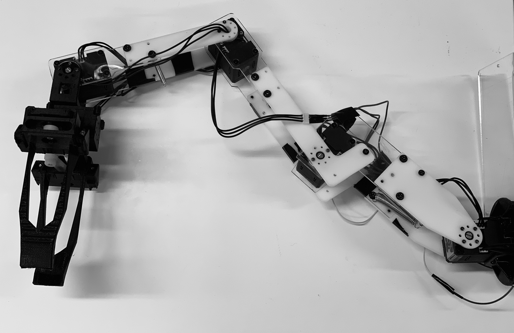
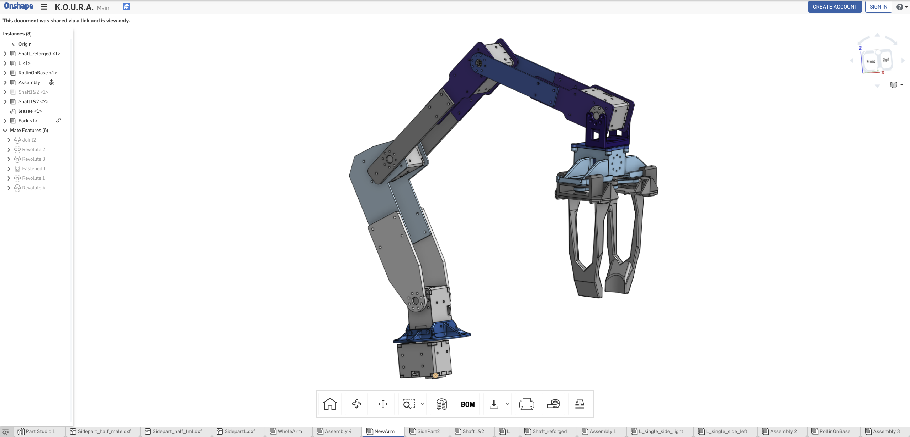

# K.O.U.R.A. (1st major version)

This file is intended to provide *very short* glance for how the arm was done.

## Introduction

K.O.U.R.A. is self-designed (well, almost) robotic arm which *should* be capable of moving chess pieces in official competition chessboard (50cm x 50cm).

As the reach of the arm should be 50cm or very close to it, the maximum reach requires a lot of torque for first and second folding joint. This required some design implementations, whereas *springs* have been used to act as counter-weight.

The actual 'Gripper' part is quite big, and therefore it is heavy. It is suitable for picking up big chess pieces from a big board. Little board is problematic, as the 'Gripper' is too big to fit in one single square.

Maybe later tinier gripper will be implemented.

## Actuators (or servos)

The arm is constructed by using two different kind of servos.

Those are:

  * Dynamixel XL430-W250 (Joints)
  * Dynamixel XL-320 (Gripper movement)

There are separate instructions for using the servos. It is provided [here.](Introduction_to_servos.md)

## Parts

To be able to create something that we are able use with our servos, parts had to be designed by ourselves.

Laser cutting and 3D printing were the available options. Both of these are requiring models provided by computer aided design. 

We noticed later, that the power of servos is inefficient for moving the parts alone, even though we tried to calculate it. Some springs have been added to act as a 'counter-weight' to help with heavy lifting.

### CAD files

This was first time for the makers to do something with CAD, so process was somewhat long with a very slow start.

However, something was finally achieved.

Final design was created by using [OnShape](https://www.onshape.com/) which is one of the few professional grade CAD design platforms working in Linux environment. Education version was used.

The CAD workspace can be found from [here.](https://cad.onshape.com/documents/67a96cddadc8cee360fb16a9/w/0d44d78b3061fe74d88e8013/e/1e171c6d9f6a35c4d1381768) Files can be exported from there with different formats.

Actual 'Gripper' component is based on [OpenManipulator](http://emanual.robotis.com/docs/en/platform/openmanipulator/), designed by ROBOTIS. It has been modified to be suitable for this project.

### Production

[Fab Lab Oulu](https://www.oulu.fi/fablab/) has been used to 3D print and laser cut suitable components.

Small components (little white ones) were printed by using [Formlabs Form 2 3D printer.](https://formlabs.com/3d-printers/form-2/). The material available at the time for this printer was [White Resin](https://formlabs.com/store/eu/form-2/materials/white-resin/).

Gripper and other big black parts were printed by using [Stratasys 380mc printer.](https://www.stratasys.com/3d-printers/fortus-380mc-450mc). The material chosen for this prototype was [PC-ABS](https://www.stratasys.com/materials/search/pc-abs).

2D parts were cut from 2/3/4mm vinyl, by using [Epilog Laser Fusion 75W CO2](https://www.epiloglaser.com/laser-machines/fusion-laser-series.htm)

### Screws and springs

TODO

## Operating and controlling

ROS packages have been used to implement actual control of arm.

Introduction for controlling and using servos can be found [here again.](Introduction_to_servos.md)

Overall workspace for all project packages can be found from [here.](../roboticTurk_ROS)
